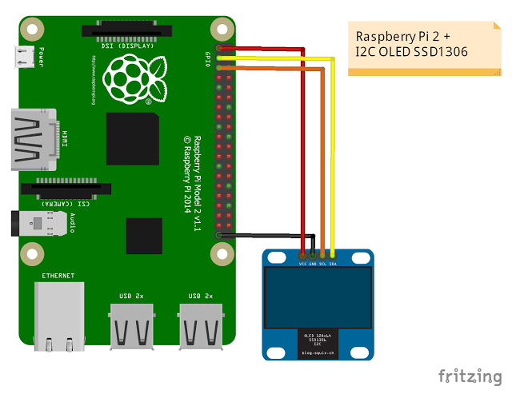
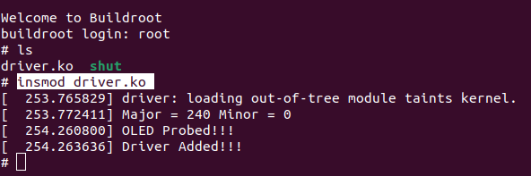
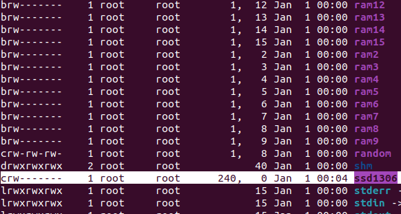

## Driver para pantalla I2C SSD1306 para SBC Raspberry Pi 4 64

### Descripción del Proyecto

Este proyecto consiste en la creación de un driver para gestionar una pantalla SSD1306 a través de I2C.

### Pasos Previos

1. **Conexión de la Pantalla:**
   Conecta la pantalla según se muestra en la siguiente imagen:

   

2. **Compilación Cruzada:**
   Una vez generado el archivo con extensión `.ko` y realizada la compilación cruzada de los programas que se ejecutarán en el espacio de usuario, procede a insertar el módulo mediante la siguiente instrucción:


```
insmod driver.ko
```



1. **Verificación:**
En la terminal, verifica que el número mayor es 240 y el número menor es 0. Esto indica que se ha creado el siguiente dispositivo en `/dev`:



### Inicialización de la Pantalla

Además del procedimiento estándar mostrado en clases, se ha inicializado la pantalla SSD1306. Esta pantalla mostrará un mensaje inicial.

<video width="320" height="240" controls>
  <source src="./picture/imd.mp4" type="video/mp4">
  Tu navegador no soporta el elemento de video.
</video>


